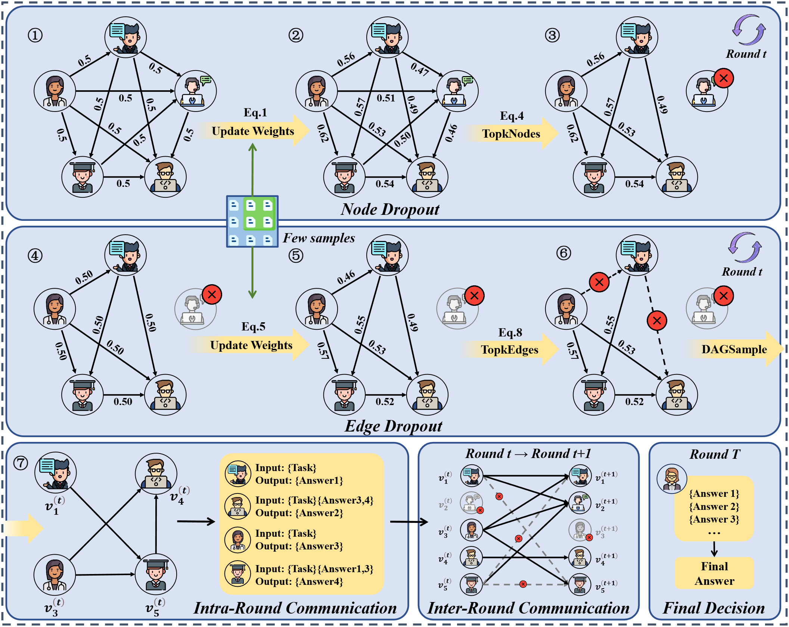

# AgentDropout

This repository releases the codes and data for the paper -- AgentDropout: Dynamic Agent Elimination for Token-Efficient and High-Performance LLM-Based Multi-Agent Collaboration.

<div align="center">
    </img>
    <p class="image-caption">AgentDropout: Dynamic Agent Elimination for Token-Efficient and High-Performance LLM-Based Multi-Agent Collaboration</p>
</div>

## **📣 News**
- Our paper has been submitted to arXiv: [https://arxiv.org/abs/2503.18891](https://arxiv.org/abs/2503.18891)!

## **🔗 Quick Links**

- **[About AgentDropout](#about)**
- **[File Structure](#structure)**
- **[Requirements](#requirements)**
- **[Quick Start](#start)**
- **[Citation](#citation)**

## **🧠 About AgentDropout**<a name="about"></a>

<!-- **AgentDropout** is a novel topology optimization method for Multi-agent system with domain transferability and structure robustness. AgentDropout dynamically adjusts the participating agents and communication links among agents in each round, allowing for more flexible and adaptive team configurations.  -->
**AgentDropout** is a novel topology optimization method for Multi-agent systems (MAS), inspired by the management theory that more flexible and adaptive team configurations can make teamwork more efficient and effective. AgentDropout dynamically identify and drop out the redundant agents and communication links in each interaction round of the MAS, allowing for higher token efficiency and task performance.
It conducts two types of dropout:
<!-- It abstracts the structures of MAS into communication graphs, with agents as nodes and the interactions between them as edges, and conduct two types of dropout: -->
- **Node Dropout**: Remove agent nodes with the smallest trainable weighted degree to involve different responsible roles in different disscussion steps.
- **Edge Dropout**: Remove interaction edges with the smallest task contribution to improve communication efficiency.

<!--  -->
<div align="center">
    </img>
    <p class="image-caption">The Frameword of AgentDropout</p>
</div>


## **📂 File Structure**<a name="structure"></a>

| Directory       | Contents              |
| --------------- | --------------------- |
| [`datasets/`](https://github.com/wangzx1219/AgentDropout/tree/main/datasets)     | Experimental data     |
| [`AgentDropout/`](https://github.com/wangzx1219/AgentDropout/tree/main/AgentDropout) | Main codes            |
| [`experiments/`](https://github.com/wangzx1219/AgentDropout/tree/main/experiments)  | Test scripts          |
| [`result/`](https://github.com/wangzx1219/AgentDropout/tree/main/result)       | Few samples of output |

## **⚙️ Requirements**<a name="requirements"></a>

1. **Environment Setup**:

```shell
conda create -n myenv python=3.10
conda activate myenv
pip install -r requirements.txt
```

2. **API Configuration**:

```python
# Update in AgentDropout/llm/gpt_chat.py
MINE_BASE_URL = ""
MINE_API_KEYS = ""
```

3. **Local Model Deployment** (Optional):

```bash
# Using vLLM for local inference
CUDA_VISIBLE_DEVICES=0 vllm serve /path/to/model --dtype auto --api-key API_KEYS --port 6789
```

```python
api_key = API_KEYS
base_url = "http://localhost:6789/v1"
```

Prepare data from [Huggingface](https://huggingface.co/). And put them in `datasets/`.

## **🚀 Quick Start**<a name="start"></a>

Run AgentDropout on GSM8K, the same as other datasets: 

```shell
python experiments/run_gsm8k.py \
  --agent_nums 5 \
  --mode FullConnected \
  --batch_size 40 \
  --num_iterations 2 \
  --imp_per_iterations 1 \
  --pruning_rate 0.10 \
  --num_rounds 2 \
  --llm_name /data/models/Meta-Llama-3-8B-Instruct \
  --optimized_spatial \
  --optimized_temporal \
  --diff \
  --dec
```

## **📜 Citation**<a name="citation"></a>

If you find this work useful, please cite:

```tex
@misc{wang2025agentdropoutdynamicagentelimination,
      title={AgentDropout: Dynamic Agent Elimination for Token-Efficient and High-Performance LLM-Based Multi-Agent Collaboration}, 
      author={Zhexuan Wang and Yutong Wang and Xuebo Liu and Liang Ding and Miao Zhang and Jie Liu and Min Zhang},
      year={2025},
      eprint={2503.18891},
      archivePrefix={arXiv},
      primaryClass={cs.CL},
      url={https://arxiv.org/abs/2503.18891}, 
}
```

## **💡 Acknowledgments**<a name="acknowledgments"></a>

Code framework based on [GPTSwarm](https://github.com/metauto-ai/GPTSwarm) and [AgentPrune](https://github.com/yanweiyue/AgentPrune).
